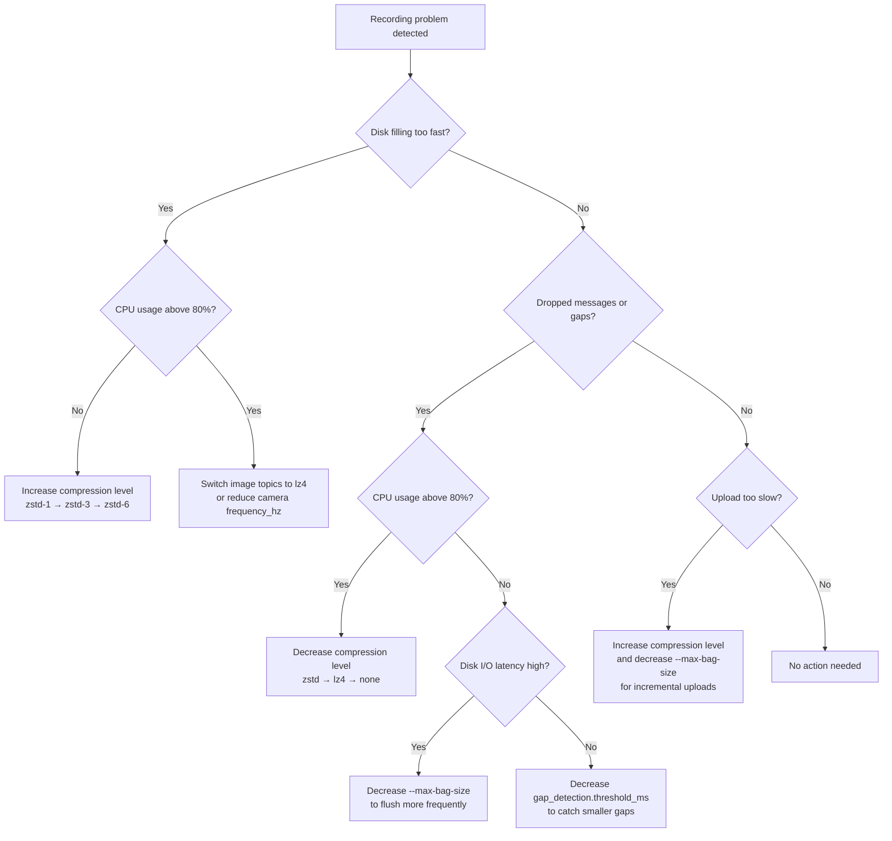

Configure bag file chunking thresholds and per-topic compression for ROS 2 edge recording on NVIDIA Jetson devices. Correct settings prevent data loss from disk exhaustion and avoid CPU overload during recording sessions.

## Prerequisites

| Requirement               | Details                                        |
| ------------------------- | ---------------------------------------------- |
| NVIDIA Jetson device      | Orin Nano (60 GB SSD) or AGX Orin (500 GB NVMe)|
| ROS 2 Humble or later     | With `rosbag2` and MCAP storage plugin         |
| Recording config schema   | `config/recording_config.yaml` from issue #197 |
| Python 3.10+              | For pydantic config validation                 |

## Quick Start

### Storage Setup

After unboxing, prepare the data drive on the Jetson device.

Orin Nano ships with a 60 GB eMMC/SSD. For sustained recording, install an M.2 NVMe drive (256 GB+). AGX Orin includes a 500 GB+ NVMe by default — skip to step 3 if already formatted.

1. Install the M.2 NVMe drive into the Jetson carrier board's M.2 Key M slot (power off first).

1. Identify the drive and create an ext4 partition:

```bash
# Identify the NVMe device
lsblk

# Partition and format (assumes /dev/nvme0n1, adjust if needed)
sudo parted /dev/nvme0n1 --script mklabel gpt mkpart primary ext4 0% 100%
sudo mkfs.ext4 -L recordings /dev/nvme0n1p1
```

1. Mount the drive and configure auto-mount on boot:

```bash
sudo mkdir -p /data/recordings
sudo mount /dev/nvme0n1p1 /data/recordings

# Persist across reboots
echo "/dev/nvme0n1p1 /data/recordings ext4 defaults,noatime 0 2" | sudo tee -a /etc/fstab
```

1. Set ownership and verify write speed:

```bash
sudo chown -R $USER:$USER /data/recordings

# Verify sequential write throughput (expect ≥400 MB/s on NVMe)
dd if=/dev/zero of=/data/recordings/test.bin bs=1M count=512 oflag=direct 2>&1 | tail -1
rm /data/recordings/test.bin
```

1. Confirm available space meets recording requirements (see [Storage Capacity Planning](#storage-capacity-planning)):

```bash
df -h /data/recordings
```

### Recording Configuration

Minimal configuration for a reference robot platform: 6-DOF UR10E arm, one RGB-D camera, joint states at 100 Hz.

1. Install ROS 2 bag recording dependencies if not already present:

```bash
sudo apt update && sudo apt install -y \
  ros-humble-rosbag2 \
  ros-humble-rosbag2-storage-mcap \
  ros-humble-rosbag2-compression-zstd
```

1. Create the configuration file on the Jetson device:

```bash
mkdir -p ~/ros2_ws/config
```

1. Save the following YAML to `~/ros2_ws/config/recording_config.yaml`:

```yaml
topics:
  - name: /camera/color/image_raw
    frequency_hz: 30.0
    compression: zstd

  - name: /joint_states
    frequency_hz: 100.0
    compression: lz4

  - name: /imu/data
    frequency_hz: 200.0
    compression: lz4

trigger:
  type: gpio
  pin: 17
  active_high: true

disk_thresholds:
  warning_percent: 80
  critical_percent: 95

gap_detection:
  threshold_ms: 100.0
  severity: warning

output_dir: /data/recordings
```

1. Source the ROS 2 environment and verify topics are publishing before recording. The topic list depends on which drivers are running (camera, robot arm, IMU):

```bash
source /opt/ros/humble/setup.bash

# List active topics — expect /camera/color/image_raw, /joint_states, /imu/data
ros2 topic list

# Confirm data is flowing (Ctrl+C to stop)
ros2 topic hz /camera/color/image_raw
```

1. Launch recording with bag chunking:

```bash
ros2 bag record \
  --storage mcap \
  --max-bag-size 1073741824 \
  --max-cache-size 104857600 \
  --config ~/ros2_ws/config/recording_config.yaml
```

1. Verify the recorded bag after stopping the recording (Ctrl+C):

```bash
# List bag metadata and confirm all expected topics appear
ros2 bag info /data/recordings/<bag_directory>
```

## Configuration Reference

### Per-Topic Compression

Each entry in the `topics` list controls recording frequency and compression for one ROS 2 topic. Field names match the schema defined in `config/recording_config.schema.json`.

| Field          | Type     | Default  | Valid Values                     | Description                                                        |
| -------------- | -------- | -------- | -------------------------------- | ------------------------------------------------------------------ |
| `name`         | `string` | required | Any valid ROS 2 topic            | Topic name, must start with `/`                                    |
| `frequency_hz` | `float`  | required | `(0, 1000]`                      | Target recording frequency; downsamples if source publishes faster |
| `compression`  | `string` | `none`   | `none`, `lz4`, `zstd`            | Compression algorithm applied to messages                          |

### Compression Algorithm Comparison

| Algorithm | Ratio (images) | Ratio (sensor) | Encode Speed (ARM) | CPU Cost | Use Case                                          |
| --------- | -------------- | -------------- | ------------------ | -------- | ------------------------------------------------- |
| `none`    | 1.0x           | 1.0x           | N/A                | Zero     | Debugging, short captures                         |
| `lz4`     | 1.5 -- 2.0x    | 2.0 -- 3.0x    | ~500 MB/s          | Low      | High-frequency streams (≥100 Hz) [^3]             |
| `zstd`    | 2.5 -- 6.0x    | 3.0 -- 10.0x   | 50 -- 300 MB/s     | Medium   | Image topics, bandwidth-limited uploads [^2] [^6] |

### Bag Chunking Parameters

Bag-level chunking controls how recorded data splits into files and flushes to disk. These parameters are passed to `ros2 bag record`, not defined in the per-topic YAML schema.

| Parameter            | Default        | Recommended          | Description                                                |
| -------------------- | -------------- | -------------------- | ---------------------------------------------------------- |
| `--max-bag-size`     | `0` (no split) | `1073741824` (1 GB)  | Split bag file at this size in bytes                       |
| `--max-bag-duration` | `0` (no split) | `300` (5 min)        | Split bag file after this duration in seconds              |
| `--max-cache-size`   | `100 MB`       | `104857600` (100 MB) | In-memory write buffer before flushing to disk             |
| `--storage`          | `sqlite3`      | `mcap`               | Storage format; MCAP supports chunk-level compression [^5] |

> [!TIP]
> Set `--max-bag-size` to 1 GB on Jetson Orin Nano. Smaller bag files enable incremental uploads and reduce data loss if a recording session is interrupted.

### Disk Thresholds

| Field              | Type  | Default | Valid Range | Description                                  |
| ------------------ | ----- | ------- | ----------- | -------------------------------------------- |
| `warning_percent`  | `int` | `80`    | `0 -- 100`  | Log warning when disk usage exceeds this     |
| `critical_percent` | `int` | `95`    | `0 -- 100`  | Stop recording when disk usage exceeds this  |

`warning_percent` must be less than `critical_percent`.

### Gap Detection

| Field          | Type     | Default   | Valid Range                       | Description                             |
| -------------- | -------- | --------- | --------------------------------- | --------------------------------------- |
| `threshold_ms` | `float`  | `100.0`   | `> 0`                             | Flag gaps longer than this threshold    |
| `severity`     | `string` | `warning` | `warning`, `error`, `critical`    | Severity level for gap detection events |

## Storage Capacity Planning

Estimates based on observed data: ~1.3 GB raw per 20-second episode with full sensor suite (RGB-D camera at 30 Hz, joint states at 100 Hz, IMU at 200 Hz) [^1]. Compression ratios derived from zstd benchmarks on the Silesia corpus [^2] and lz4 benchmarks [^3], scaled to ROS 2 message payloads.

### Calculation Methodology

Raw GB/hour per modality, computed from ROS 2 message sizes at the reference platform's publish rates:

| Modality     | Message Size                         | Frequency | Raw Rate  | Raw GB/hour |
| ------------ | ------------------------------------ | --------- | --------- | ----------- |
| RGB camera   | 480 × 848 × 3 B = 1.22 MB            | 30 Hz     | 36.6 MB/s | 129         |
| Depth camera | 480 × 848 × 2 B = 0.81 MB            | 30 Hz     | 24.4 MB/s | 81          |
| Joint states | ~5.6 KB (6-DOF `JointState`)         | 100 Hz    | 0.56 MB/s | 2           |
| IMU          | ~30 KB (`Imu` + covariance matrices) | 200 Hz    | 6.1 MB/s  | 22          |

Compressed estimates divide the raw rate by the effective compression ratio at each zstd level. Ratios are interpolated from Silesia corpus benchmarks [^2] and adjusted for ROS 2 message payloads:

| zstd Level | Image Ratio | Sensor Ratio |
| ---------- | ----------- | ------------ |
| zstd-1     | ~2.5x       | ~3.0x        |
| zstd-3     | ~4.0x       | ~5.0x        |
| zstd-6     | ~6.0x       | ~8.0x        |

Cross-check: 1.3 GB raw ÷ 20 seconds = 0.065 GB/s = 234 GB/hour, matching the full-suite (camera + joints + IMU) row [^1].

### Estimated Storage Consumption (GB/hour)

| Modality              | Raw | zstd-1 | zstd-3 | zstd-6 |
| --------------------- | --- | ------ | ------ | ------ |
| Camera only (RGB-D)   | 210 |     84 |     52 |     35 |
| Camera + joints       | 212 |     85 |     53 |     35 |
| Camera + joints + IMU | 234 |     94 |     59 |     39 |

Camera data dominates storage consumption. Joint states and IMU contribute < 1% of total volume but are critical for policy training.

### Recording Duration Until Disk Full

Device storage capacities from NVIDIA Jetson module specifications [^4]. Orin Nano base SSD is 60 GB; AGX Orin typically ships with 500 GB+ NVMe [^1].

| Device          | Usable Storage | zstd-1      | zstd-3      | zstd-6       |
| --------------- | -------------- | ----------- | ----------- | ------------ |
| Orin Nano (SSD) | 50 GB          | 32 min      | 51 min      | 1 hr 17 min  |
| Orin Nano (M.2) | 200 GB         | 2 hr 8 min  | 3 hr 23 min | 5 hr 8 min   |
| AGX Orin (NVMe) | 450 GB         | 4 hr 47 min | 7 hr 37 min | 11 hr 32 min |

Usable storage assumes 15% reserved for OS and applications. Durations use the full sensor suite: 1 RGB camera (480 × 848, 30 Hz) + 1 depth camera (480 × 848, 30 Hz) + 6-DOF joint states (100 Hz) + 1 IMU (200 Hz) — 234 GB/hour raw, compressed at respective zstd levels.

## Recommended Settings

### 6-DOF Arm with RGB-D Camera (Reference Platform)

```yaml
topics:
  - name: /camera/color/image_raw
    frequency_hz: 30.0
    compression: zstd       # Highest storage savings on dominant data stream

  - name: /camera/depth/image_raw
    frequency_hz: 30.0
    compression: zstd

  - name: /joint_states
    frequency_hz: 100.0
    compression: lz4        # Low latency at high frequency

  - name: /imu/data
    frequency_hz: 200.0
    compression: lz4
```

### Bandwidth-Constrained Upload Environment

Reduce camera frequency and maximize compression to fit upload windows:

```yaml
topics:
  - name: /camera/color/image_raw
    frequency_hz: 10.0       # Downsample from 30 Hz
    compression: zstd

  - name: /joint_states
    frequency_hz: 100.0
    compression: zstd        # Use zstd even for joints to minimize upload size
```

## Decision Flowchart

Use this flowchart when recording performance degrades or storage fills faster than expected.



> [!IMPORTANT]
> Increasing compression level reduces storage and upload size but increases CPU load. Increasing chunk size (`--max-bag-size`) improves write throughput but increases data loss risk on interruption.

## Troubleshooting

### Disk Full During Recording

Recording stops abruptly when `disk_thresholds.critical_percent` is exceeded.

- Check usage with `df -h /data/recordings`
- Lower `disk_thresholds.warning_percent` for earlier alerts
- Increase compression level on camera topics from `lz4` to `zstd`
- Reduce `--max-bag-size` to enable faster upload and deletion of completed bags
- Add external M.2 NVMe storage on Orin Nano to expand from 60 GB to 256+ GB

### Compression CPU Overload

Gap detection triggers frequently, `top` shows high CPU on the recording process, and frames drop.

- Monitor with `tegrastats | grep CPU`
- Switch high-frequency topics (≥100 Hz) from `zstd` to `lz4`
- Keep `zstd` only on camera topics where the compression ratio justifies the cost
- Reduce `frequency_hz` on non-critical topics to lower total throughput
- On Orin Nano (6-core), reserve at least 2 cores for compression by limiting other workloads

### Chunk Manifest Corruption

`ros2 bag info` reports missing chunks or metadata errors and the bag file is unreadable.

- Verify with `ros2 bag info /data/recordings/<bag_directory>`
- Set `--max-cache-size` to at least `104857600` (100 MB) to avoid partial flushes under load
- Use MCAP storage format (`--storage mcap`) which stores chunk manifests inline and recovers from truncation
- Decrease `--max-bag-size` so each file contains fewer chunks, limiting blast radius
- Check SSD health with `smartctl -a /dev/nvme0n1`

### Decompression Failures

Post-processing or LeRobot conversion fails with codec errors (`zstd: error` in output).

- Verify versions with `python -c "import zstandard; print(zstandard.__version__)"`
- Ensure `zstandard` Python package matches the version used during recording
- Install system zstd library: `apt install libzstd-dev`
- Re-record a short test episode and verify round-trip: record → compress → decompress → validate
- If bag was recorded with a newer zstd version, upgrade the decompression environment to match

## Related Documentation

- [LeRobot Inference](../lerobot-inference.md) for policy deployment after training on recorded data
- [Security Guide](../security-guide.md) for data encryption of recorded bags at rest

## Sources

[^1]: Issue #207 technical notes — observed ~1.3 GB raw per 20-sec episode, ~10 MB after LeRobot conversion; Jetson Orin Nano SSD 60 GB base, AGX Orin 500 GB+ NVMe.
[^2]: [Zstandard (zstd) benchmarks](https://github.com/facebook/zstd#benchmarks) — compression ratio 2.896x at level 1 on Silesia corpus, 510 MB/s encode on x86; ARM throughput scaled proportionally.
[^3]: [LZ4 benchmarks](https://github.com/lz4/lz4#benchmarks) — compression ratio 2.101x, 780 MB/s encode on x86 (Core i7-9700K); ARM Cortex-A78AE throughput estimated at ~60-70% of x86.
[^4]: [NVIDIA Jetson Modules](https://developer.nvidia.com/embedded/jetson-modules) — Jetson Orin Nano and AGX Orin series specifications.
[^5]: [MCAP ROS 2 storage plugin](https://mcap.dev/guides/getting-started/ros-2) — `rosbag2_storage_mcap` with chunk-level compression (Lz4, Zstd) and `--storage-config-file` options.
[^6]: [Zstandard RFC 8878](https://datatracker.ietf.org/doc/html/rfc8878) — Zstandard compression data format specification.
