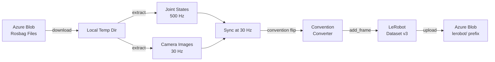

# ROS Bag to LeRobot Converter

Convert ROS bag recordings to LeRobot v3 datasets with Azure Blob Storage integration.

Downloads rosbag recordings from Azure Blob Storage, extracts joint state and camera data, synchronizes streams at the target frame rate, applies coordinate conventions, and produces LeRobot-compatible datasets ready for policy training.

## Architecture



## Prerequisites

| Requirement | Version |
|-------------|---------|
| Python | >= 3.10 |
| uv | Latest |
| Azure CLI | Logged in (`az login`) |
| ROS bags | ROS2 Humble `.db3`/`.mcap` or ROS1 `.bag` |

## Quick Start

### Install

```bash
cd rosbag-to-lerobot
uv venv .venv --python 3.10
# Windows
.\.venv\Scripts\activate
# Linux/macOS
source .venv/bin/activate
uv pip install -e ".[dev]"
```

### Configure

Edit `config.yaml` with your Azure Blob Storage account URL and container name.

### List Available Bags

```bash
rosbag-to-lerobot list --config config.yaml
```

### Inspect a Bag

```bash
rosbag-to-lerobot inspect /path/to/bag
```

### Convert from Blob Storage

```bash
rosbag-to-lerobot convert --config config.yaml
```

### Convert Local Bags

```bash
rosbag-to-lerobot convert --local-bag /path/to/bag --no-upload --output-dir ./output
```

### Override Task Description

```bash
rosbag-to-lerobot convert --config config.yaml --task "Pick up red block"
```

## Configuration

| Section | Key | Default | Description |
|---------|-----|---------|-------------|
| `blob_storage` | `account_url` | `""` | Azure storage account URL |
| `blob_storage` | `container` | `rosbag-recordings` | Blob container name |
| `blob_storage` | `rosbag_prefix` | `recordings/ur10e/` | Source rosbag prefix |
| `blob_storage` | `lerobot_prefix` | `lerobot/` | Output dataset prefix |
| `dataset` | `repo_id` | `hve-robo/ur10e-rosbag-converted` | Dataset repository ID |
| `dataset` | `robot_type` | `ur10e` | Robot type identifier |
| `dataset` | `fps` | `30` | Target frame rate |
| `dataset` | `task_description` | `UR10e manipulation task` | Task label for frames |
| `dataset` | `vcodec` | `libsvtav1` | Video codec |
| `topics` | `joint_states` | `/joint_states` | ROS topic for joint states |
| `topics` | `camera` | `/camera/color/image_raw` | ROS topic for camera |
| `conventions` | `apply_joint_sign` | `true` | Apply RTDE→training sign flip |
| `conventions` | `joint_sign` | `[1,-1,-1,1,1,1]` | Per-joint sign mask |
| `conventions` | `wrap_angles` | `true` | Wrap angles to (-π, π] |
| `conventions` | `image_resize` | `[480, 848]` | Target image size [H, W] |
| `ros` | `distro` | `ROS2_HUMBLE` | ROS distribution for type resolution |
| `processing` | `temp_dir` | `null` | Temp directory (null = system temp) |
| `processing` | `cleanup_temp` | `true` | Delete temp files after upload |
| `processing` | `episode_gap_threshold_s` | `2.0` | Gap threshold for episode splitting |
| `processing` | `split_episodes` | `false` | Auto-detect episode boundaries |

## Convention Handling

The UR10e RTDE driver reports joint positions with opposite signs for shoulder and elbow compared to the training data convention. The converter applies a configurable sign mask:

```
RTDE:     [base, +shoulder, +elbow, wrist1, wrist2, wrist3]
Training: [base, -shoulder, -elbow, wrist1, wrist2, wrist3]
```

Default mask: `[1.0, -1.0, -1.0, 1.0, 1.0, 1.0]`

All joint angles are wrapped to (-π, π] to match the training distribution.

Disable with `--no-sign-flip` CLI flag or set `conventions.apply_joint_sign: false` in config.

## Project Structure

```
rosbag-to-lerobot/
├── pyproject.toml           # Package manifest and dependencies
├── config.yaml              # Default conversion configuration
├── README.md
├── rosbag_to_lerobot/
│   ├── __init__.py
│   ├── blob_storage.py      # Azure Blob Storage download/upload
│   ├── cli.py               # CLI entry point (convert, list, inspect)
│   ├── config.py             # Dataclass config with YAML loader
│   ├── conventions.py        # Joint sign flip, angle wrapping, image resize
│   ├── converter.py          # Main conversion orchestration
│   ├── rosbag_reader.py      # Pure-Python rosbag reader
│   └── sync.py               # Temporal synchronization at target FPS
└── tests/
    ├── test_conventions.py
    ├── test_converter.py
    └── test_sync.py
```

## Troubleshooting

| Issue | Solution |
|-------|----------|
| `DefaultAzureCredential` fails | Run `az login` to authenticate |
| No bags found | Check `blob_storage.rosbag_prefix` in config |
| Joint count mismatch | Verify the rosbag contains 6-DOF joint states |
| Image decoding fails | Check camera topic name and message type |
| High sync offset warnings | Camera and joint clocks may be unsynchronized |
| `ModuleNotFoundError: lerobot` | Install with `pip install lerobot` |
